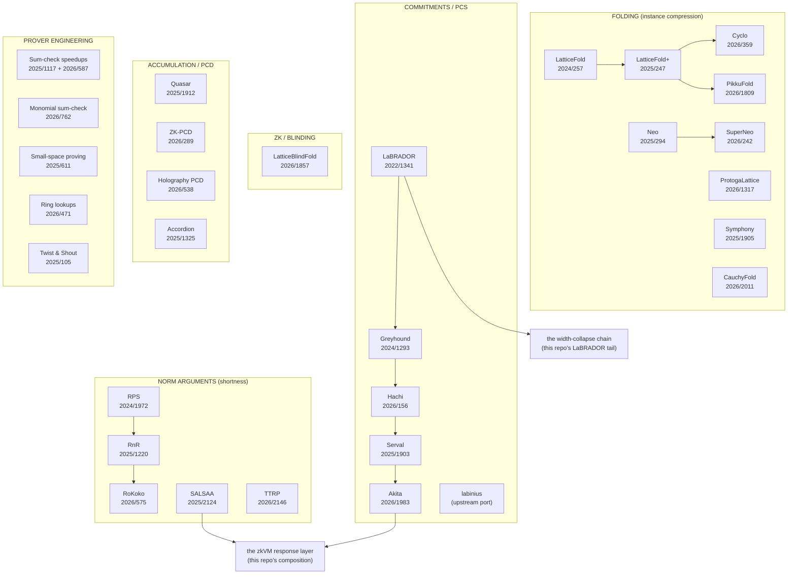

# The Papers Map — Inner Connections

**How the implemented papers relate to each other and to the zkVM
stack.** This is the navigation document for the repository's
intellectual structure: every edge states WHAT FLOWS (the technique
one paper contributes to another), and every node links to its crate
and its coverage file (`docs/papers/{implemented,partially-implemented}/`).
For the per-part coverage status, see `docs/papers/README.md`; for the
backlog, `NEXT_STEPS.md`; for the build history, `IMPLEMENTATION_LOG.md`.

---

## 1. The six lineages (the field's own dependency graph)



## 2. What flows where (the inner connections, edge by edge)

### The commitment spine

| From → To | What flows |
|---|---|
| **Ajtai's OWF** (the SIS hash) → everything | `t = A·v` with short `v`: the single primitive every crate's commitment layer instantiates (`lattice-commitment`, `lattice-labinius`, `lattice-labrador`, `lattice-greyhound`). |
| **LaBRADOR → Greyhound** | the amortized linear-relation proofs (LIFTS aggregation, the g/h garbage discipline, the 2r−1 tail); Greyhound re-implements the engine at q = 2^32−99 and adds the PCS wrapper (`σ^{-1}` translation, CWSS extraction). |
| **LaBRADOR → the width fold** (`lattice-widthfold`) | the degree discipline itself: quadratic cross-terms pre-committed as garbage so the response stays AFFINE in the challenge (fork width 2 — the stage-local degree law of `docs/analysis/MULTISTAGE_EXTRACTION.md`); the `[A₂ \| −T]` MSIS-instance posture; the JL projection inside the fold's challenge sampling. |
| **Greyhound → Hachi → Serval → Akita** | the PCS lineage's refinements: ring-switching (Hachi's subfield embedding), slack-free split-and-fold (Serval's exact-ℓ2 extraction), two-tier + response-chunking at VM scale (Akita). Each consumed the predecessor's opening discipline. |
| **labinius → the compact mode** (`lattice-zkvm::compact`) | the SECONDARY structure: the r-aligned column layout with the column-uniform key, the shadow weights `Ψ(m) = eq_head·2^{8b(m)}`, and the column fold — the discipline the D4 capacity split reuses verbatim. |
| **Akita → the D4 response layer** (`lattice-akita::salsa_binding`) | the packed byte-commitment (`commit_bytes`) that the binding closure authenticates: the width-collapse chain PROVES the level-1 `F̄·v = t` equation instead of assuming its MSIS hardness. |

### The norm spine (shortness is the currency)

| From → To | What flows |
|---|---|
| **RPS → RnR → RoKoko** | the norm-argument refinements: from ℓ∞-range checks to relaxed-norm recursion to the coarse/fine committed refinement (`lattice-rokoko`). |
| **SALSAA → the D1 layer** (`lattice-salsa::ring_norm`) | Π^norm ∘ Π^sum: the degree-2 norm sumcheck with the F_{q²} conjugation/trace terminal, and **Lemma-4** — the no-wraparound gate `m·n·B² < q/2` that (a) caps the byte-packed regime at 2,048 values/commitment and (b) reappears lifted to the whole chain as the unwind norm law E3 of the extraction ledger. |
| **SALSAA → the D4 carrier** (`lattice-akita::salsa_response`) | the ψ-functional: `Σ_c eq(r_sc,x(c))·2^{8b(c)}·z(c) = f(r_sc)` — the byte-recomposition bridge binding field claims to byte witnesses with VERIFIER-computed weights. |
| **TTRP → the shortness toolbox** (`lattice-ttrp`) | the tensor-train random projection: the digit-free ℓ2 certificate the norm spine can swap in where gadget decomposition is too coarse. |
| **LatticeFold+ (2026/721) → the norm ledger** (`lfplus_l2`) | the JL-projection RoK + exact shortening: the no-drift accounting the folding instances consume. |

### The folding spine (instance compression)

| From → To | What flows |
|---|---|
| **ProtogaLattice → the fold core** | the constant-round PGL-Fold/Boot with exact cross-term extraction (finite-difference Newton inversion) — the cross-term bookkeeping pattern every later fold reuses. |
| **LatticeFold+ / Cyclo / PikkuFold / Symphony / SuperNeo / CauchyFold** | the folding design space: padding fixes and norm control (LF+), partial range + the **§7 R1CS-over-F_q bridge** with the θ_k digit map (Cyclo — consumed by the compact-PCS terminal), layered biased-ternary projections (PikkuFold), μ-arity one-shot folding (Symphony), committed relaxed instances (SuperNeo), residue-optimal carriers (CauchyFold). |
| **Quasar → the accumulation discipline** (`lattice-lookup`) | multi-instance accumulation via union polynomials + the 2-to-1 fold — the pattern the PCD line scales up. |
| **ZK-PCD + Holography PCD + Accordion** (`lattice-pcd`, `lattice-holo`, `lattice-accordion`) | the PCD compositions: masked sum-checks with point updates, holographic accumulation, and the IPA-sumcheck bridge with the amortized decider — the designated route for folding the D4 split's r column-chains into ONE accumulator (the documented follow-up). |

### The engineering spine (making it fast)

| From → To | What flows |
|---|---|
| **Twist & Shout → the memory arguments** (`lattice-memory`, `lattice-zkvm`) | the read/write timeline (Twist) + read-only table (Shout) grand-product identities — the zkVM's RAM/register ports and the sparse "0s are free" engine. |
| **Sum-check speedups + monomial sum-check + small-space** (`lattice-sumcheck`, `lattice-projsumcheck`, `lattice-streaming`) | the window prover, multiproduct ladders, the `{0,∞}` projective protocol, and the O(n)-space streaming/client-side discipline — every sumcheck-heavy layer above consumes these. |
| **Ring lookups** (`lattice-lookup-ring`) | lookups over the CRT-split ring itself (Ring-Plookup/LogUp) — the v3 pipeline's memory-argument replacement and the Greyhound-style compile onto the Ajtai/carrier stack. |
| **LatticeBlindFold → the ZK layer** (`lattice-blindfold`) | the blinding stack (masked sum-check + ABDLOP commit-and-prove) — the designated zero-knowledge route for the fold/response layers (Wave 8.6). |

## 3. The composition stack (how the zkVM assembles the papers)

```text
RV64IMAC program
  │ lattice-vm (the canonical decoder + traced executor)
  ▼
the trace columns ── committed ──► lattice-akita (Ajtai/PCS spine)
  │                                        │
  ▼                                        ▼
Twist & Shout memory arguments      the D4 response layer:
(lattice-memory, sparse engine)      carrier (RLC sumcheck)
  │                                        │
  ▼                                        ├─ D1 norm (SALSAA, Lemma-4 gate)
the claim table ─────────────────────────►├─ ψ-functional (byte recomposition)
                                           └─ THE BINDING: the width-collapse
                                              chain (LaBRADOR's degree law +
                                              the estimator-gated [A₂|−T]
                                              instances) ── the extraction
                                              ledger's five laws
  │
  ▼
the decider: verify_program — never re-executes; the Cyclo §7
bridge's compact-PCS terminal carries the witness-free decisions
```

## 4. The honest boundary (what the map does not yet show as edges)

* the D4 split's r column-chains are not yet folded into one
  accumulator (the Quasar/PCD edge is designed, not drawn);
* zero-knowledge edges (LatticeBlindFold ↔ the fold/response layers)
  are specified but not wired (Wave 8.6);
* the Modulus-50 class (the norm headroom route for the chain's
  unwind law at wide gates) exists in `lattice-ring` but is not yet
  the widthfold's operating modulus.

See `NEXT_STEPS.md` §"the next highest-value items" for the live list.
